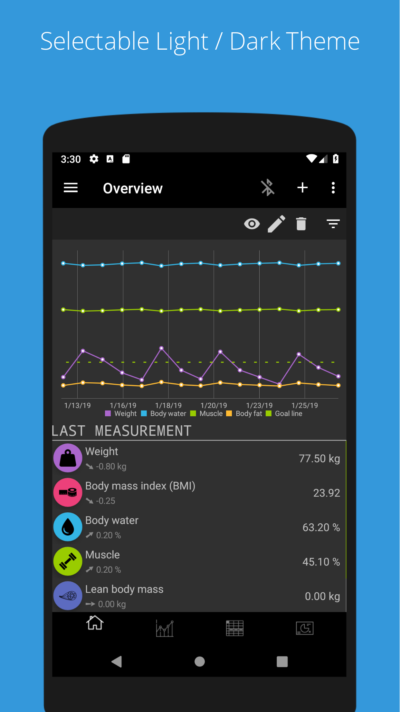

&nbsp;  &nbsp;openScale 

=========

Open-source weight and body metrics tracker, with support for Bluetooth scales

Install [openScale-dev-build.apk](https://github.com/oliexdev/openScale/releases/tag/travis-dev-build) to get the latest development build generated by [Travis CI](https://travis-ci.org/). Also be aware that this version may contain bugs and you don't get any automatic updates.

# Summary

Monitor and track your weight, BMI, body fat, body water, muscle and other body metrics in an open source app that:
* has an easy to use user interface with graphs,
* doesn't require you to create an account,
* can be configured to only show the metrics you care about, and
* respects your privacy and lets you decide what to do with your data.

# Bluetooth scales
openScale has built-in support for a number of Bluetooth (BLE or "smart") scales from  many manufacturers, e.g. Beurer, Sanitas, Yunmai, Xiaomi, etc. (see model list below). Together with our users we constantly improve and extend the set of supported scales and in many cases pick up where the original app falls short.

For scales without Bluetooth, or Bluetooth scales not (yet) supported by openScale, measurements can be manually entered in a quick and easy way.

# Privacy
This app has no ads and requests no unnecessary permissions. The location permission is only needed to find a Bluetooth scale. Once found the permission can be revoked (or never granted if Bluetooth isn't used).

# Supported metrics
Weight, BMI (body mass index), body water, muscle, LBM (lean body mass), body fat, bone mass, waist circumference, waist-to-height ratio, hip circumference, waist-hip ratio, visceral fat, chest circumference, thigh circumference, biceps circumference, neck circumference, body fat caliper, BMR (basal metabolic rate), TDEE (Total Daily Energy Expenditure) and Calories. Each entry can also have an optional comment.

<b>Note:</b> don't worry if you think the list is too long: metrics you don't use can be disabled and hidden.

# Other features
- Resizable widget to show the latest measurement on the home screen
- Configure your weight unit: kg, lb or st
- Set a goal to help keep your diet
- Displays all your data on a chart and in a table to track your progress
- Evaluates measurements and gives a quick visual feedback to show you if you're within or outside the recommended range given your age, sex, height etc.
- Import or export your data from/into a CSV (comma separated value) file
- Supports body fat, body water and lean body mass estimations based on scientific publications. Useful if your scale doesn't support those measurements.
- Support for multiple users
- Partially or fully translated into more than 27 languages, see [weblate project site](https://hosted.weblate.org/projects/openscale/#languages) for the full list
- Optional dark theme selectable

# Supported Bluetooth scales
- Custom made Bluetooth scale
- Beurer BF700, BF710 and BF800
- Digoo DG-S038H
- Excelvan CF369BLE
- Exingtech Y1
- Hesley (Yunchen)
- MGB
- Medisana BS444, BS440
- Runtastic Libra
- Sanitas SBF70
- Silvercrest SBF75
- Xiaomi Mi scale v1 and v2
- Yunmai Mini and SE
- iHealth HS3
- Easy Home 64050
- and many more

Please see [openScale wikipage](https://github.com/oliexdev/openScale/wiki/Supported-scales-in-openScale) for the full list and the level of support for each scale.

# Support

Before asking, please first read the [FAQ](https://github.com/oliexdev/openScale/wiki/Frequently-Asked-Questions-(FAQ)), the [openScale wiki](https://github.com/oliexdev/openScale/wiki) and try to [find an answer](https://github.com/oliexdev/openScale/issues) in existing issues. If you still haven't found an answer, please create a [new issue](https://github.com/oliexdev/openScale/issues/new/choose) on GitHub.

# Contributing

If you found a bug, have an idea how to improve the openScale app or have a question, please create new issue or comment existing one. If you would like to contribute code, fork the repository and send a pull request.

If you want to help to support your Bluetooth scale please see [here](https://github.com/oliexdev/openScale/wiki/How-to-reverse-engineer-a-Bluetooth-4.x-scale) for further information.

If you want to help to translate the app in your language please see [here](https://github.com/oliexdev/openScale/wiki/Frequently-Asked-Questions-(FAQ)#why-is-my-language-xyz-is-missing-or-incomplete)

# Screenshots

<table>
  <tr>
    <th>
        
    </th>
    <th>
        
    </th>
    <th>
        
    </th>
    <th>
        
    </th>
  </tr>
  
  <tr>
    <th>
        
    </th>
    <th>
        
    </th>
    <th>
        
    </th>
    <th>
        
    </th>
  </tr>
</table>

# License

openScale is licensed under the GPL v3, see LICENSE file for full notice.

    Copyright (C) 2014  olie.xdev <olie.xdev@googlemail.com>
    
    This program is free software: you can redistribute it and/or modify
    it under the terms of the GNU General Public License as published by
    the Free Software Foundation, either version 3 of the License, or
    (at your option) any later version.

    This program is distributed in the hope that it will be useful,
    but WITHOUT ANY WARRANTY; without even the implied warranty of
    MERCHANTABILITY or FITNESS FOR A PARTICULAR PURPOSE.  See the
    GNU General Public License for more details.

    You should have received a copy of the GNU General Public License
    along with this program.  If not, see <http://www.gnu.org/licenses/>
