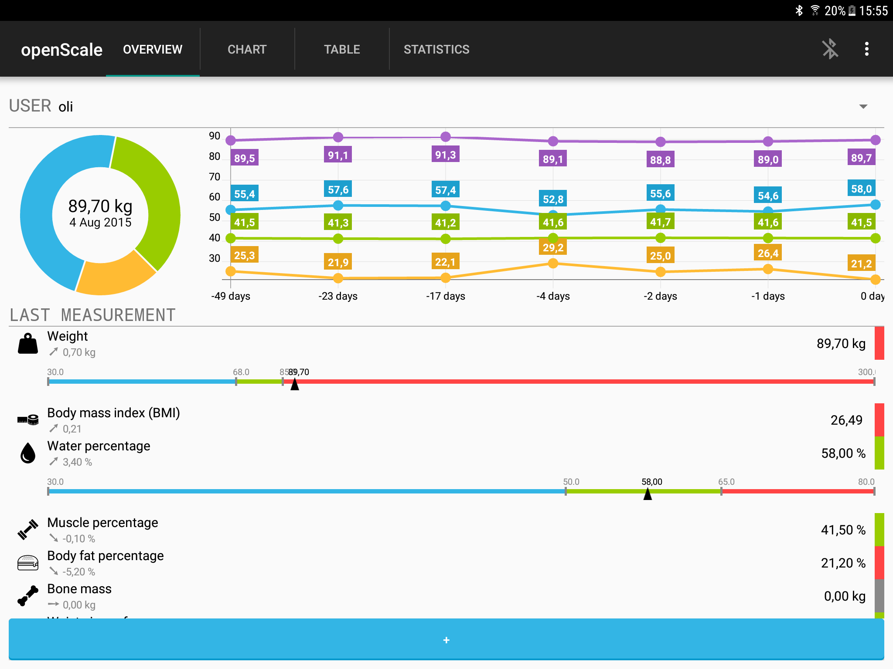
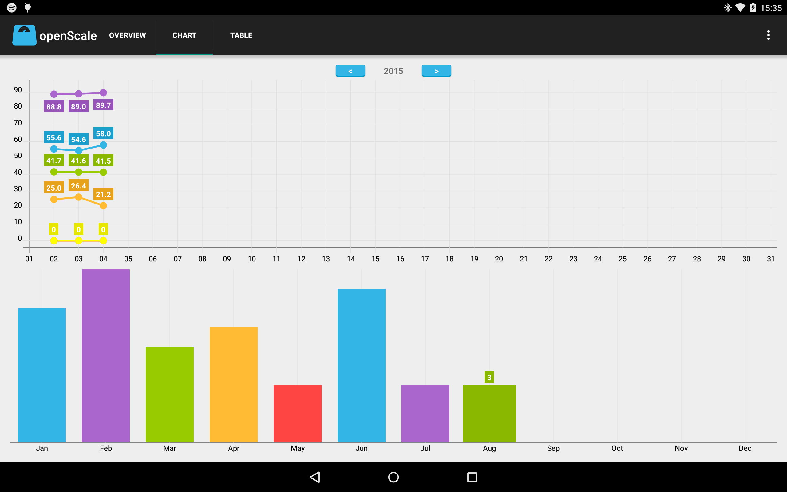
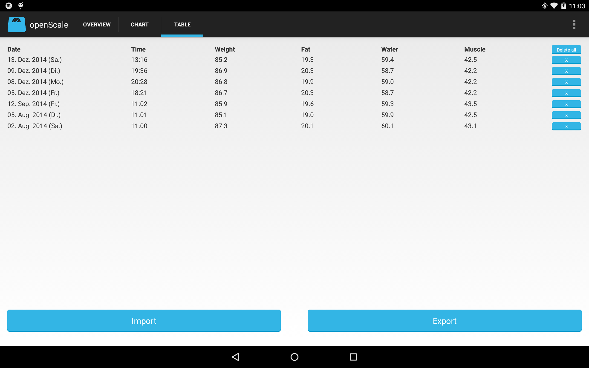
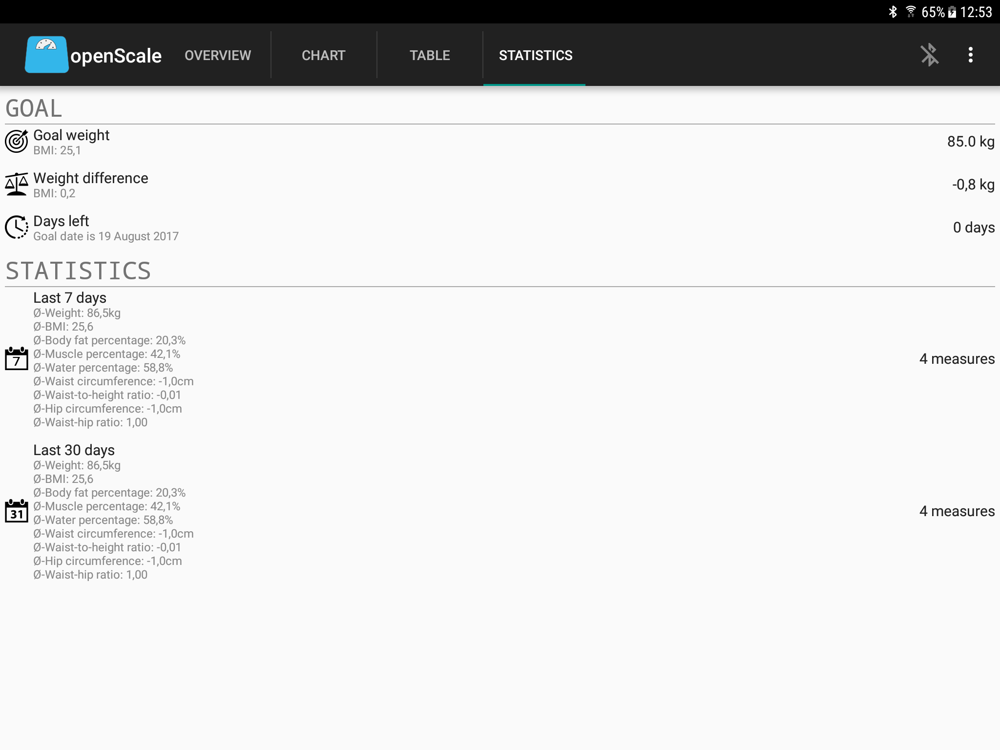
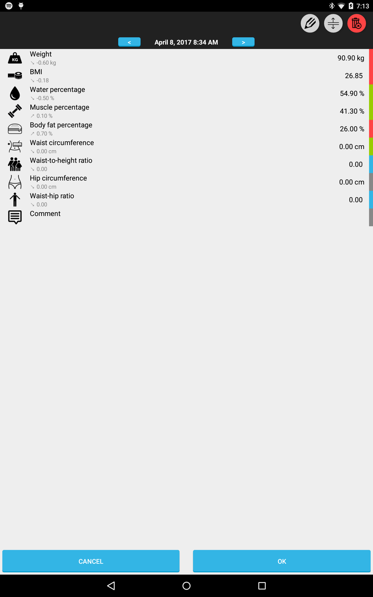

openScale 
=========

openScale is an open source app which support various Bluetooth scales to keep easy log of your body metrics.

Install [openScale-dev-build.apk](https://github.com/oliexdev/openScale/releases) to get the latest development build generated by [Travis CI](https://travis-ci.org/). But be aware that this version may contain bugs and you don't get any automatically updates. 

# Features

- Logs your body metrics (weight, body fat, body water, muscle percentage, lean body mass, bone mass, BMI, BMR, waist/hip circumference, waist-hip ratio, waist-to-height ratio)
- Keep track of your diet process
- Display all your data on a chart and table 
- Import or export your data from/into a CSV file
- Estimates body metrics (body fat, body water and lean body mass) based on scientic publications
- Support for multiple users
- Partially or full support for custom made Bluetooth scale, Xiaomi Mi scale v1/v2, Sanitas SBF70, Medisana BS444, Digoo DG-S038H, Yunmai Mini, Excelvan CF369BLE, Yunmai SE, MGB, Exingtech Y1, Beurer BF700/800 (see [openScale wiki](https://github.com/oliexdev/openScale/wiki/Supported-scales-in-openScale) for details)
- Partially or full translated into English, German, Japanese, French, Polish, Brazilian portuguese, Slovak, Turkish, Swedish, Spanish
- No advertising and for free
- All data belongs to you (no cloud service)

# Supported Bluetooth scales

Please see in the [openScale wiki](https://github.com/oliexdev/openScale/wiki/Supported-scales-in-openScale) which Bluetooth scales are full or parially supported.

# Contributing

If you found a bug, have an idea how to improve the openScale app or have a question, please create new issue or comment existing one. If you would like to contribute code, fork the repository and send a pull request.

If you want to help to support your Bluetooth scale please see [here](https://github.com/oliexdev/openScale/wiki/How-to-reverse-engineer-a-Bluetooth-4.x-scale) for further information.

# Screens

<table>
  <tr>
    <th>
          
        <b>overview page</b>
    </th>
    <th>
          
        <b>graph page</b>
    </th>
  </tr>
  
  <tr>
    <td>
          
        <b>table page</b>
    </td>
    <td>
          
        <b>statistics page</b>
    </td>
  </tr>
  <tr>
    <td>
          
        <b>data entry page</b>
    </td>
    <td>
    <!-- empty cell -->
    </td>
  </tr>
</table>

# License

openScale is licensed under the GPL v3, see LICENSE file for full notice.

    Copyright (C) 2014  olie.xdev <olie.xdev@googlemail.com>
    
    This program is free software: you can redistribute it and/or modify
    it under the terms of the GNU General Public License as published by
    the Free Software Foundation, either version 3 of the License, or
    (at your option) any later version.

    This program is distributed in the hope that it will be useful,
    but WITHOUT ANY WARRANTY; without even the implied warranty of
    MERCHANTABILITY or FITNESS FOR A PARTICULAR PURPOSE.  See the
    GNU General Public License for more details.

    You should have received a copy of the GNU General Public License
    along with this program.  If not, see <http://www.gnu.org/licenses/>
