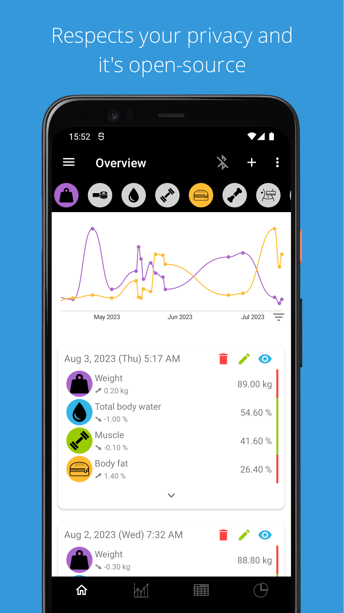
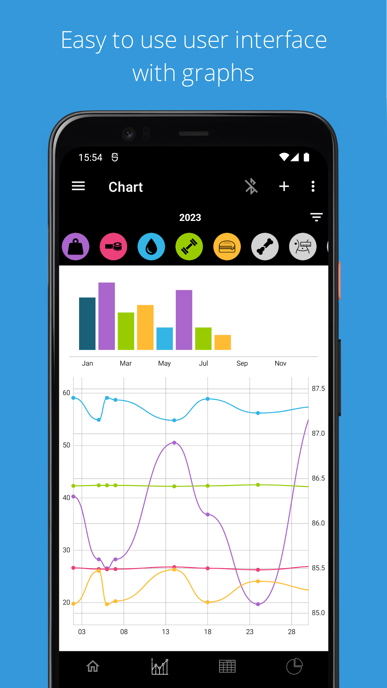
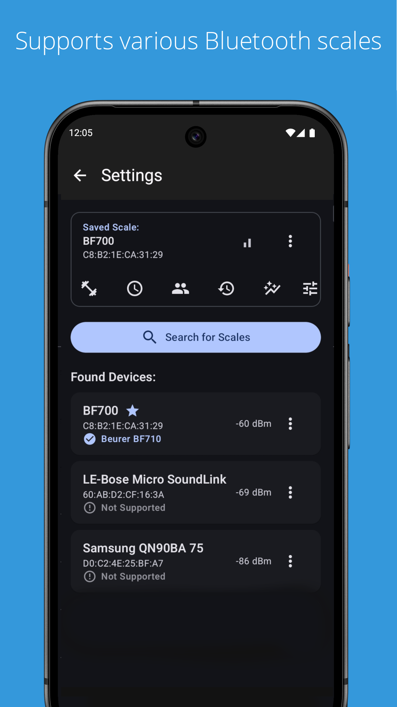
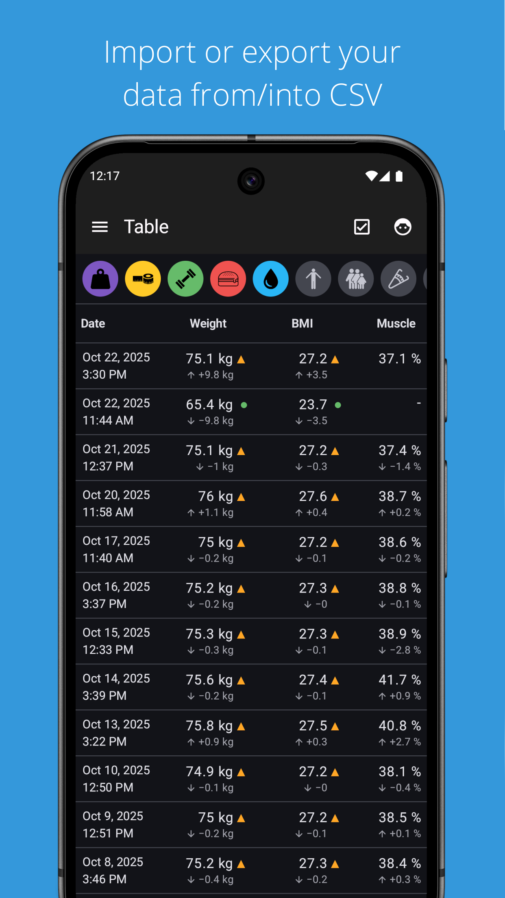
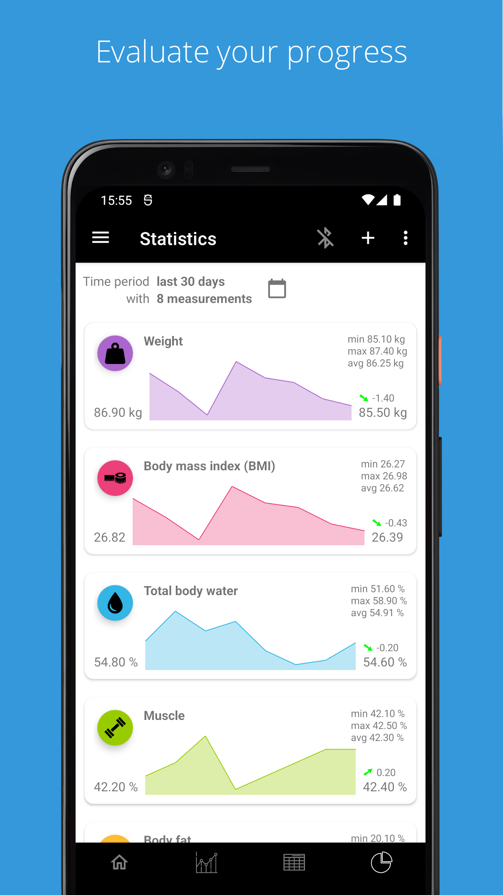
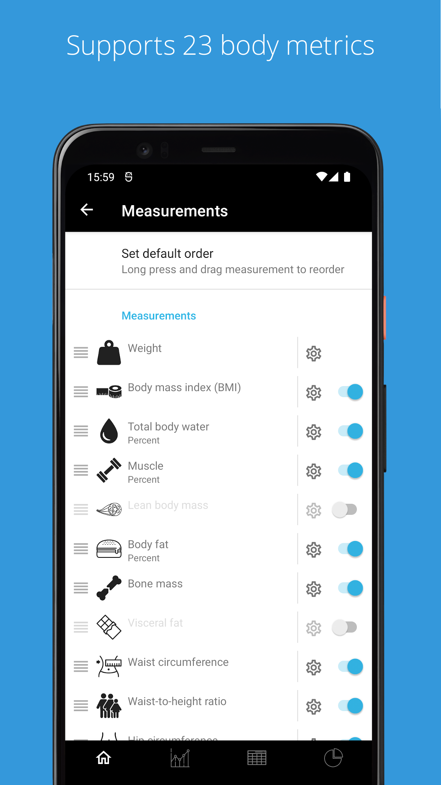
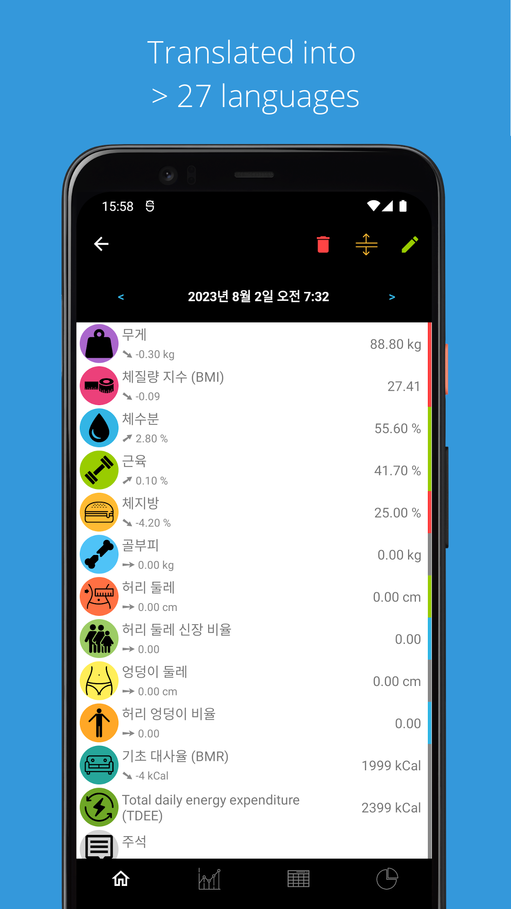
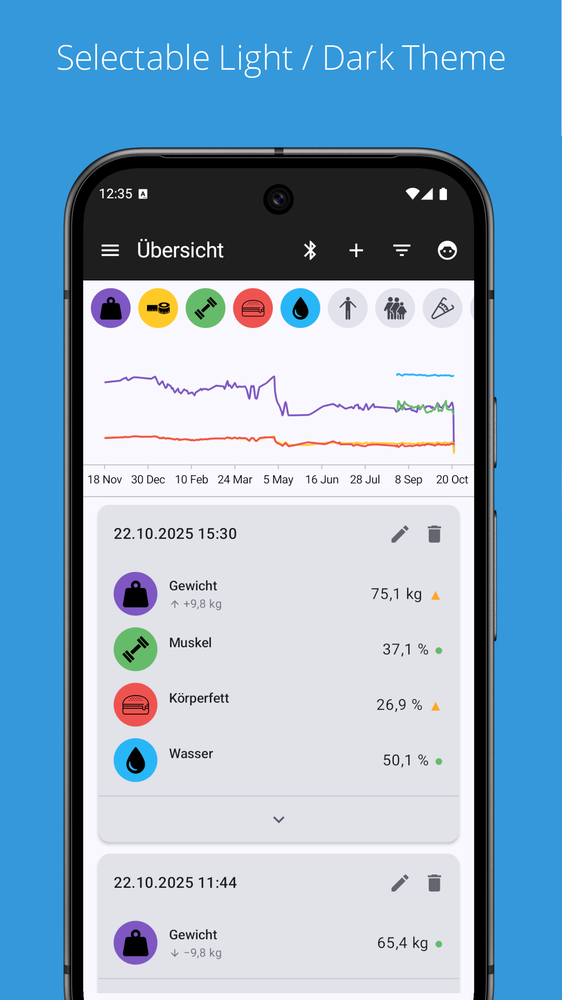

&nbsp;  &nbsp;openScale [](https://github.com/oliexdev/openScale/actions/workflows/ci_master.yml)
[](https://hosted.weblate.org/engage/openscale/?utm_source=widget)
=========

Open-source weight and body metrics tracker, with support for Bluetooth scales

<a href="https://f-droid.org/repository/browse/?fdid=com.health.openscale" target="_blank">
  
</a>
<a href="https://play.google.com/store/apps/details?id=com.health.openscale.oss" target="_blank">
  
</a>

> [!NOTE]
> On [Google Play](https://play.google.com/store/apps/details?id=com.health.openscale.oss) the **openScale** version is offered as an open beta.
> 
> For the latest development state, install the latest [openScale dev](https://github.com/oliexdev/openScale/releases/tag/dev-build) build from the [GitHub release page](https://github.com/oliexdev/openScale/releases).
> Please be aware that the development version, may contain bugs, and will not receive automatic updates.

# Summary :clipboard:

Monitor and track your weight, BMI, body fat, body water, muscle and other body metrics in an open source app that:
* has an easy to use user interface with graphs,
* supports various Bluetooth scales,
* doesn't require you to create an account,
* can be configured to only show the metrics you care about, and
* respects your privacy and lets you decide what to do with your data.

# Supported Bluetooth scales :rocket:
openScale has built-in support for a number of Bluetooth (BLE or "smart") scales from  many manufacturers, e.g. Beurer, Sanitas, Yunmai, Xiaomi, etc. (see model list below). Together with our users we constantly improve and extend the set of supported scales and in many cases pick up where the original app falls short.

- Custom made Bluetooth scale
- Beurer BF700, BF710, BF800, BF105, BF720, BF600, BF850 and BF950
- Digoo DG-S038H
- Excelvan CF369BLE
- Exingtech Y1
- Hesley (Yunchen)
- MGB
- Medisana BS444, BS440
- Runtastic Libra
- Sanitas SBF70
- Silvercrest SBF75, SBF77
- Vigorun
- Xiaomi Mi scale v1 and v2
- Yunmai Mini and SE
- iHealth HS3
- Easy Home 64050
- and many more

Please see [openScale wikipage](https://github.com/oliexdev/openScale/wiki/Supported-scales-in-openScale) for the full list and the level of support for each scale.

For scales without Bluetooth, or Bluetooth scales not (yet) supported by openScale, measurements can be manually entered in a quick and easy way.

# Supported metrics :chart_with_upwards_trend:
Weight, BMI (body mass index), body water, muscle, LBM (lean body mass), body fat, bone mass, waist circumference, waist-to-height ratio, hip circumference, waist-hip ratio, visceral fat, chest circumference, thigh circumference, biceps circumference, neck circumference, body fat caliper, BMR (basal metabolic rate), TDEE (Total Daily Energy Expenditure), Calories and custom metrics. Each entry can also have an optional comment.

<b>Note:</b> don't worry if you think the list is too long: metrics you don't use can be disabled and hidden.

# Other features :zap:
- Resizable widget to show the latest measurement on the home screen
- Configure your weight unit: kg, lb or st
- Set a goal to help keep your diet
- Displays all your data on a chart and in a table to track your progress
- Evaluates measurements and gives a quick visual feedback to show you if you're within or outside the recommended range given your age, sex, height etc.
- Import or export your data from/into a CSV (comma separated value) file
- Supports body fat, body water and lean body mass estimations based on scientific publications. Useful if your scale doesn't support those measurements.
- Support for multiple users
- Support for assisted weighing (e.g. for babies or pets)
- Support for people with amputations
- Partially or fully translated, see [weblate project site](https://hosted.weblate.org/projects/openscale/#languages) for the full list
- Optional dark theme selectable

# Privacy :lock:
This app has no ads and requests no unnecessary permissions. The location permission is only needed to find a Bluetooth scale. Once found the permission can be revoked (or never granted if Bluetooth isn't used).

openScale doesn't send any data to a cloud and not having permission to access the internet is a strong guarantee of that.

If you want to synchronize your openScale measurements with external services, you can install [openScale sync](https://github.com/oliexdev/openScale-sync).

# Questions & Issues :thinking:

Before asking, please first read the [FAQ](https://github.com/oliexdev/openScale/wiki/Frequently-Asked-Questions-(FAQ)), the [openScale wiki](https://github.com/oliexdev/openScale/wiki) and try to [find an answer](https://github.com/oliexdev/openScale/issues) in existing issues. If you still haven't found an answer, please create a [new issue](https://github.com/oliexdev/openScale/issues/new/choose) on GitHub.

# Donations :heart:

If you would like to support this project's further development, the creator of this project or the continuous maintenance of this project, feel free to donate via [](https://www.paypal.com/cgi-bin/webscr?cmd=_s-xclick&hosted_button_id=H5KSTQA6TKTE4&source=url) or become a [](https://github.com/sponsors/oliexdev). Your donation is highly appreciated. Thank you!

# Contributing :+1:

If you found a bug, have an idea how to improve the openScale app or have a question, please create new issue or comment existing one. If you would like to contribute code, fork the repository and send a pull request.

If you want to help to support your Bluetooth scale please see [How-to support a new scale](https://github.com/oliexdev/openScale/wiki/How-to-support-a-new-scale) for further information.

If you want to help to translate the app in your language please see [here](https://github.com/oliexdev/openScale/wiki/Frequently-Asked-Questions-(FAQ)#why-is-my-language-xyz-is-missing-or-incomplete)

# Screenshots :eyes:

<table>
  <tr>
    <th>
        <a href="docs/screens/1_overview.png" target="_blank">
         </a>
    </th>
    <th>
        <a href="docs/screens/2_chart.png" target="_blank">
         </a>
    </th>
    <th>
        <a href="docs/screens/3_bluetooth.png" target="_blank">
         </a>
    </th>
    <th>
        <a href="docs/screens/4_table.png" target="_blank">
         </a>
    </th>
  </tr>
  
  <tr>
    <th>
        <a href="docs/screens/5_statistics.png" target="_blank">
         </a>
    </th>
    <th>
        <a href="docs/screens/6_body_metrics.png" target="_blank">
         </a>
    </th>
    <th>
        <a href="docs/screens/7_translations.png" target="_blank">
         </a>
    </th>
    <th>
        <a href="docs/screens/8_themes.png" target="_blank">
         </a>
    </th>
  </tr>
</table>

# Data Export & Integration :electric_plug:

openScale supports pushing measurements to external services via **Webhook** and **InfluxDB** export, configurable under *Settings → Data Management*.

## Webhook Export

On every new measurement, openScale sends an HTTP POST with a JSON body to a configurable URL. This makes it easy to integrate with any service that accepts webhooks (e.g. Home Assistant, n8n, Supabase, custom APIs).

**JSON payload schema:**

```json
{
  "timestamp": 1778076662705,
  "id": 4,
  "userId": 1,
  "weight": 66.5,
  "body_fat": 13.04,
  "water": 59.66,
  "muscle": 44.74,
  "visceral_fat": 5.00,
  "bone": 2.58,
  "lbm": 57.83
}
```

The three base fields are always present. All measurement fields are **only included if the scale (or manual entry) provides them** — the exact set depends on what your scale supports.

| Field | Type | Description |
|---|---|---|
| `timestamp` | `long` | Unix timestamp in milliseconds |
| `id` | `int` | Measurement ID |
| `userId` | `int` | App user ID |
| `weight` | `float` | Weight in the user's configured unit (kg / lb / st) |
| `bmi` | `float` | Body mass index |
| `body_fat` | `float` | Body fat (% or kg/lb/st) |
| `water` | `float` | Body water (% or kg/lb/st) |
| `muscle` | `float` | Muscle mass (% or kg/lb/st) |
| `lbm` | `float` | Lean body mass (kg/lb/st) |
| `bone` | `float` | Bone mass (kg/lb) |
| `waist` | `float` | Waist circumference (cm/in) |
| `whr` | `float` | Waist-to-hip ratio |
| `whtr` | `float` | Waist-to-height ratio |
| `hips` | `float` | Hip circumference (cm/in) |
| `visceral_fat` | `float` | Visceral fat level |
| `chest` | `float` | Chest circumference (cm/in) |
| `thigh` | `float` | Thigh circumference (cm/in) |
| `biceps` | `float` | Biceps circumference (cm/in) |
| `neck` | `float` | Neck circumference (cm/in) |
| `caliper_1` / `caliper_2` / `caliper_3` | `float` | Body fat caliper measurements (cm/in) |
| `caliper` | `float` | Calculated body fat from caliper (%) |
| `bmr` | `float` | Basal metabolic rate (kcal) |
| `tdee` | `float` | Total daily energy expenditure (kcal) |
| `heart_rate` | `int` | Heart rate (bpm) |
| `calories` | `float` | Calories (kcal) |
| `comment` | `string` | Optional comment |
| `custom_<id>` | `float / int / string` | Custom metric with its type ID |

**Test your endpoint with [webhook.site](https://webhook.site)** — create a free temporary URL and paste it into the Webhook URL field to inspect live requests.

## InfluxDB Export

Measurements are sent as [InfluxDB Line Protocol](https://docs.influxdata.com/influxdb/v2/reference/syntax/line-protocol/) via HTTP POST on every new measurement. Both InfluxDB v1 and v2 are supported.

Configure under *Settings → Data Management → InfluxDB Export*:
- **Host URL** — e.g. `http://192.168.1.100:8086`
- **Database / Bucket** — target database (v1) or bucket (v2)
- **Measurement name** — InfluxDB measurement/table name
- **Field mapping** — customize field names to match existing Grafana dashboards

## Automatic Backups

The app can automatically back up its database on a configurable interval (daily / weekly / monthly) to a folder of your choice. Configure under *Settings → Data Management → Automatic Backups*.

# License :page_facing_up:

openScale is licensed under the GPL v3, see LICENSE file for full notice.

    Copyright (C) 2025  olie.xdev <olie.xdeveloper@googlemail.com>
    
    This program is free software: you can redistribute it and/or modify
    it under the terms of the GNU General Public License as published by
    the Free Software Foundation, either version 3 of the License, or
    (at your option) any later version.

    This program is distributed in the hope that it will be useful,
    but WITHOUT ANY WARRANTY; without even the implied warranty of
    MERCHANTABILITY or FITNESS FOR A PARTICULAR PURPOSE.  See the
    GNU General Public License for more details.

    You should have received a copy of the GNU General Public License
    along with this program.  If not, see <http://www.gnu.org/licenses/>
