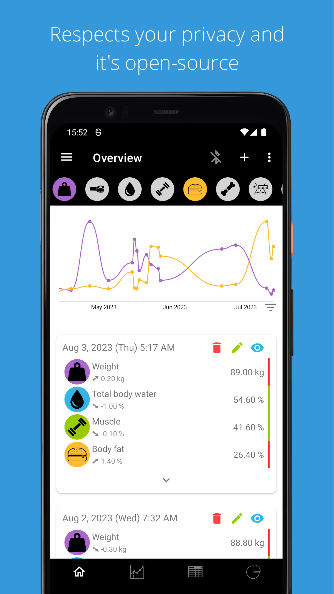
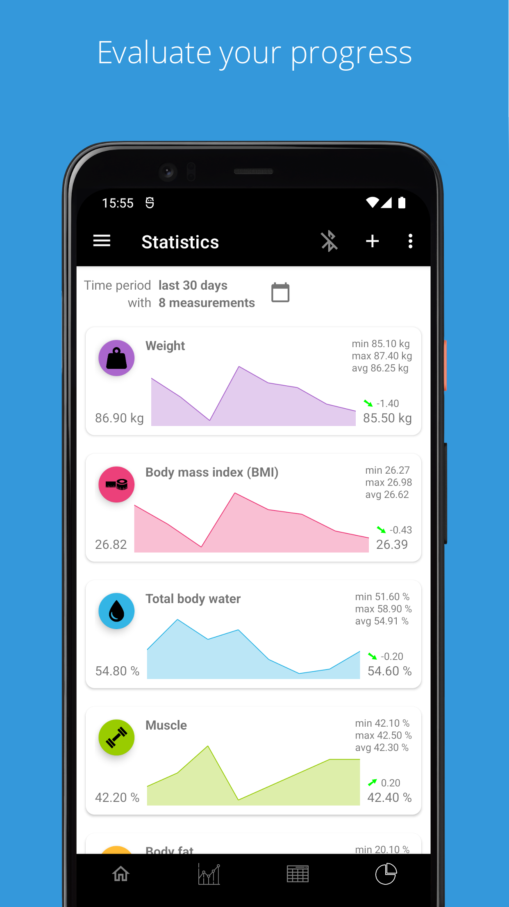
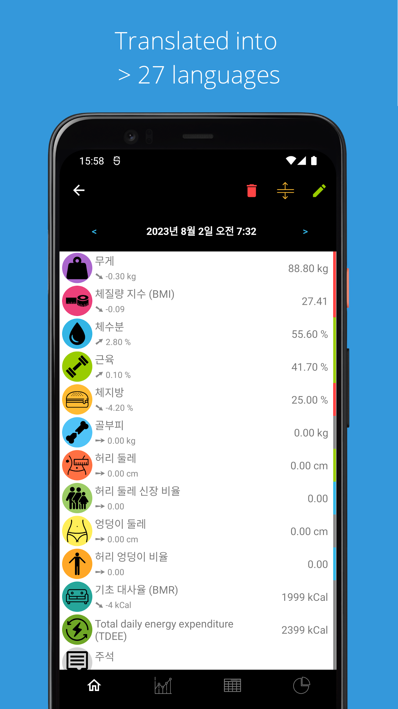

&nbsp;  &nbsp;openScale 

=========

Copylefted libre software weight and body metrics tracker, with support for Bluetooth scales

Install [openScale-dev-build.apk](https://github.com/oliexdev/openScale/releases/tag/travis-dev-build) to get the latest development build generated by [Travis CI](https://travis-ci.org/). Also be aware that this version may contain bugs and you don't get any automatic updates.

# Summary :clipboard:

Use the app to monitor and track your weight, BMI, body fat, body water, muscle and other body metrics:
* Easy to use user interface with graphs.
* Support for various Bluetooth scales.
* No account required.
* Show only the metrics you care about.
* Privacy and the ability to do what you want with _your_ data.

# Supported Bluetooth scales :rocket:
Built-in support for a number of Bluetooth (BLE or "smart") scales from  many manufacturers. Beurer, Sanitas, Yunmai, Xiaomi, etc. (listed below). Together with our users we constantly improve and extend the set of supported scales and in many cases pick up where the original app falls short.

- Custom made Bluetooth scale
- Beurer BF700, BF710 and BF800
- Digoo DG-S038H
- Excelvan CF369BLE
- Exingtech Y1
- Hesley (Yunchen)
- MGB
- Medisana BS444, BS440
- Runtastic Libra
- Sanitas SBF70
- Silvercrest SBF75
- Vigorun
- Xiaomi Mi scale v1 and v2
- Yunmai Mini and SE
- iHealth HS3
- Easy Home 64050
- + many more

Please consult the [openScale wikipage](https://github.com/oliexdev/openScale/wiki/Supported-scales-in-openScale) for the full list and supported features of each scale.

For scales without Bluetooth, or Bluetooth scales not (yet) supported by openScale, measurements can be manually entered in a quick and easy way.

# Supported metrics :chart_with_upwards_trend:
Weight, BMI (body mass index), body water, muscle, LBM (lean body mass), body fat, bone mass, waist circumference, waist-to-height ratio, hip circumference, waist-hip ratio, visceral fat, chest circumference, thigh circumference, biceps circumference, neck circumference, body fat caliper, BMR (basal metabolic rate), TDEE (Total Daily Energy Expenditure) and calories. Each entry can also have an optional comment.

<b>Note:</b> Metrics you don't use can be turned off and hidden.

# Other features :zap:
- Resizable widget to show the latest measurement on the home screen.
- Configure your weight unit: kg, lb or st.
- Set a goal to help keep your diet.
- Displays all your data on a chart and in a table to track your progress.
- Evaluates measurements and gives a quick visual feedback to show you if you're within or outside the recommended range given your age, sex, height etc.
- Import or export your data from/into a CSV (comma separated value) file.
- Supports body fat, body water and lean body mass estimations based on scientific publications. Useful if your scale doesn't support those measurements.
- Support for multiple users.
- Partially or fully translated into more than 27 languages, see [weblate project site](https://hosted.weblate.org/projects/openscale/#languages) for the full list.
- Optional dark theme.

# Privacy :lock:
No ads and no unnecessary permissions. Location permission is only needed to find a Bluetooth scale. Once found the permission can be revoked (or never granted if Bluetooth isn't used).

openScale doesn't send any data to a cloud. It doesn't even have Internet access.

If you want to synchronise your weight to GoogleFit and/or MQTT 3.1, you can install [openScale sync](https://github.com/oliexdev/openScale/wiki/openScale-sync) from [GooglePlay](https://play.google.com/store/apps/details?id=com.health.openscale.sync).

# Questions & Issues :thinking:

Before asking, please first read the [FAQ](https://github.com/oliexdev/openScale/wiki/Frequently-Asked-Questions-(FAQ)), the [openScale wiki](https://github.com/oliexdev/openScale/wiki) and try to [find an answer](https://github.com/oliexdev/openScale/issues) in existing issues. If you still haven't found an answer, please create a [new issue](https://github.com/oliexdev/openScale/issues/new/choose) on GitHub.

# Donations :heart:

Support the creator in further development and maintenance of this project. It is highly appreciated. Thank you!

# Contributing :+1:
Found a bug or have a question or idea of how to improve the openScale app? Open an issue or comment on an existing one. Contribute code by forking the repository and sending in a pull request.

Help support your Bluetooth scale [here](https://github.com/oliexdev/openScale/wiki/How-to-reverse-engineer-a-Bluetooth-4.x-scale).

Translate the app in your language [here](https://github.com/oliexdev/openScale/wiki/Frequently-Asked-Questions-(FAQ)#why-is-my-language-xyz-is-missing-or-incomplete)

# Screenshots :eyes:

<table>
  <tr>
    <th>
        
    </th>
    <th>
        
    </th>
    <th>
        
    </th>
    <th>
        
    </th>
  </tr>
  
  <tr>
    <th>
        
    </th>
    <th>
        
    </th>
    <th>
        
    </th>
    <th>
        
    </th>
  </tr>
</table>

# License :page_facing_up:

openScale is licensed GPLv3+, see the LICENSE file for the full notice.

    Copyright (C) 2014  olie.xdev <olie.xdev@googlemail.com>
    
    This program is free software: you can redistribute it and/or modify
    it under the terms of the GNU General Public License as published by
    the Free Software Foundation, either version 3 of the License, or
    (at your option) any later version.

    This program is distributed in the hope that it will be useful,
    but WITHOUT ANY WARRANTY; without even the implied warranty of
    MERCHANTABILITY or FITNESS FOR A PARTICULAR PURPOSE.  See the
    GNU General Public License for more details.

    You should have received a copy of the GNU General Public License
    along with this program.  If not, see <http://www.gnu.org/licenses/>
